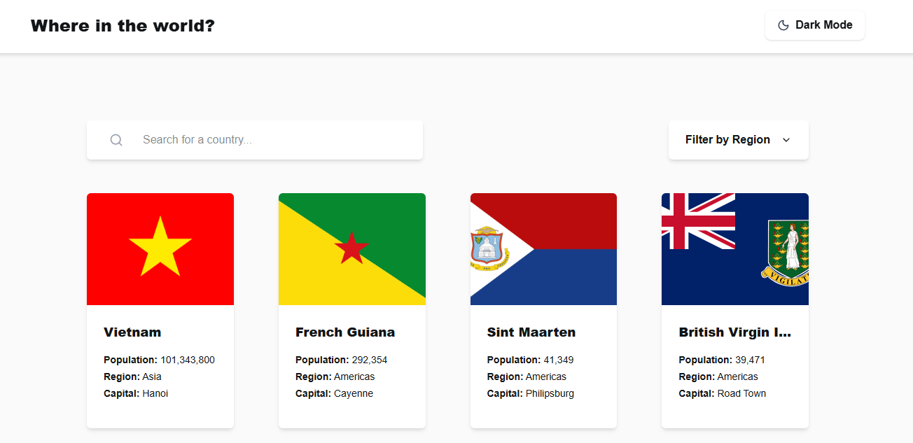
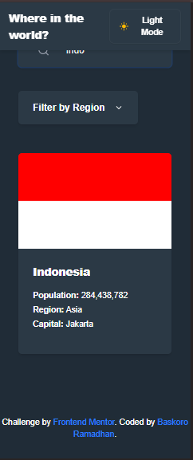
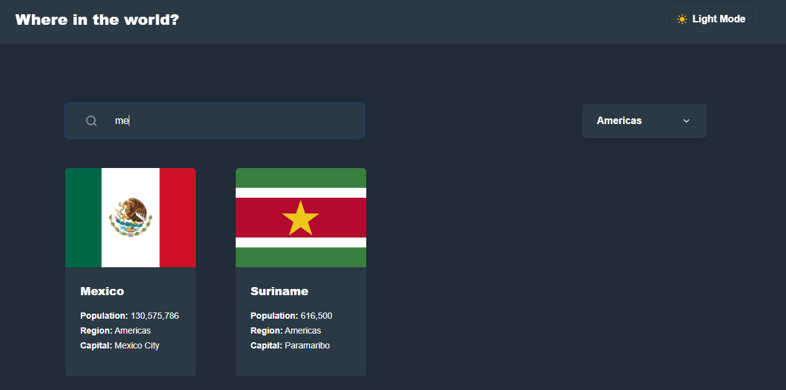

# Frontend Mentor - REST Countries API with color theme switcher solution

This is a solution to the [REST Countries API with color theme switcher challenge on Frontend Mentor](https://www.frontendmentor.io/challenges/rest-countries-api-with-color-theme-switcher-5cacc469fec04111f7b848ca).

## Table of contents

- [Overview](#overview)
  - [The challenge](#the-challenge)
  - [Screenshot](#screenshot)
  - [Links](#links)
- [My process](#my-process)
  - [Built with](#built-with)
  - [What I learned (Bug Log)](#what-i-learned-bug-log)
- [Author](#author)

## Overview

### The challenge

Users should be able to:

- See all countries from the API on the homepage
- Search for a country using an `input` field
- Filter countries by region
- Click on a country to see more detailed information on a separate page
- Click through to the border countries on the detail page
- Toggle the color scheme between light and dark mode

### Screenshot

|        Desktop Preview         |        Mobile Preview         |
| :----------------------------: | :---------------------------: |
|  |  |

|            Search Feature             |
| :-----------------------------------: |
|  |

### Links

- Solution URL: [GitHub Repository](https://github.com/BaskoroR725/30-REST-Countries-API-with-color-theme-switcher)
- Live Site URL: [GitHub Pages](https://baskoror725.github.io/30-REST-Countries-API-with-color-theme-switcher/)

## My process

### Built with

- **React 19**
- **TypeScript**
- **Tailwind CSS v4**
- **Tanstack Router** (File-based routing)
- **Zustand** (State management)
- **Framer Motion** (Animations)
- **Vitest** (Unit testing)
- **Bun** (Runtime & Package Manager)

### What I learned (Bug Log)

During the development of this project, I encountered several technical challenges and bugs. Here is how they were resolved:

#### 1. Tailwind CSS v4 — Dark Mode Configuration

- **Problem**: Utility classes like `dark:*` were not working despite adding the `.dark` class to the HTML element.
- **Reason**: In Tailwind v4, the `@theme` block is strictly for CSS variables. Manually toggling dark mode requires a specific `@custom-variant`.
- **Solution**: Added the official Tailwind v4 manually-toggled dark mode variant to `index.css`.

  ```css
  @custom-variant dark (&:where(.dark, .dark *));
  ```

#### 2. REST Countries API — 10 Fields Limit

- **Problem**: API requests to `v3.1/all` failed with a `400 Bad Request`.
- **Reason**: The API now enforces a strict 10-field maximum when using the `fields` query parameter. Requesting more than 10 or requesting none at all can trigger errors.
- **Solution**: Limited the query to exactly the 10 most essential fields and mapped the data carefully in the store.

  ```typescript
  const response = await fetch(
    "https://restcountries.com/v3.1/all?fields=name,capital,region,subregion,population,flags,cca3,currencies,languages,borders",
  );
  ```

#### 3. Zustand Persist — Hydration Race Condition

- **Problem**: When a user refreshed the page with dark mode enabled, the UI would flicker or remain in light mode for a moment.
- **Reason**: Zustand's `persist` middleware rehydrates state asynchronously, often finishing _after_ the initial component render.
- **Solution**: Implemented `onRehydrateStorage` to immediately synchronize the DOM with the stored state as soon as it's ready.

  ```typescript
  onRehydrateStorage: () => (state) => {
    if (state) applyThemeClass(state.isDarkMode);
  },
  ```

#### 4. TypeScript `global` Error in Unit Tests

- **Problem**: `Cannot find name 'global'` when mocking fetch.
- **Solution**: Used `globalThis` for cross-environment compatibility in JSDOM.

#### 5. Deployment White Screen (GitHub Pages)

- **Problem**: Incorrect asset paths on GitHub Pages.
- **Solution**: Set `base` path in `vite.config.ts` and configured the router basepath.

## Author

- **Baskoro Ramadhan**
- Frontend Mentor - [@BaskoroR725](https://www.frontendmentor.io/profile/BaskoroR725)
